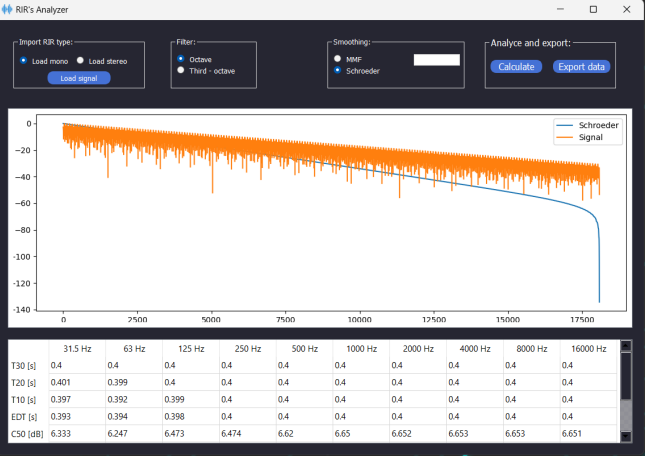

# RIRs_PROCESSER

Aplicación de escritorio creada con Python la cual puede recibir archivos de audio en formato .wav, tanto en Mono o Estéreo. Permite aplicar un filtrado por octava o por tercio de octavas y elegir entre un suavizado por Filtro de Media Movil o por Schroeder. También permite la visualización de un gráfico correspondiente a la señal procesada y una grilla de datos con la opción de exportar los resultados obtenidos.

